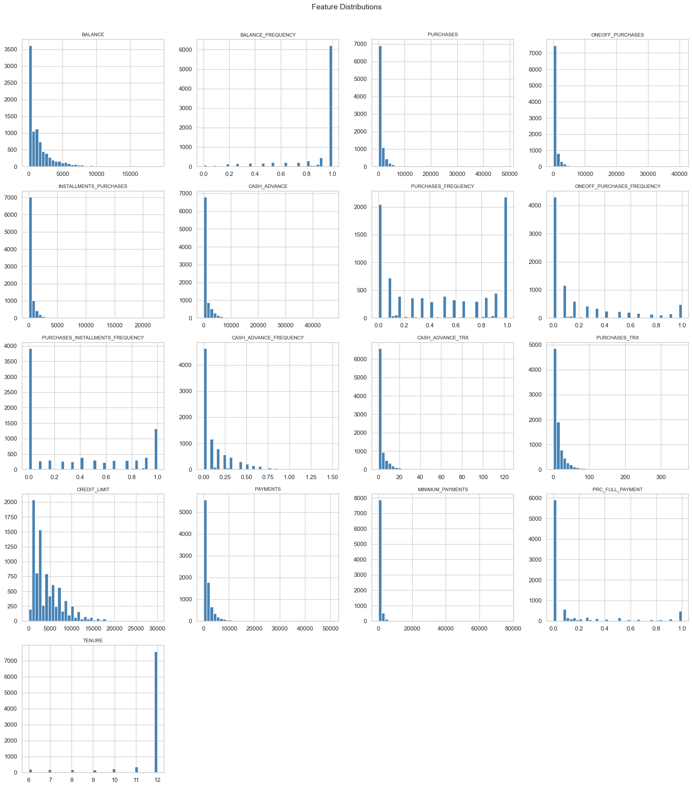
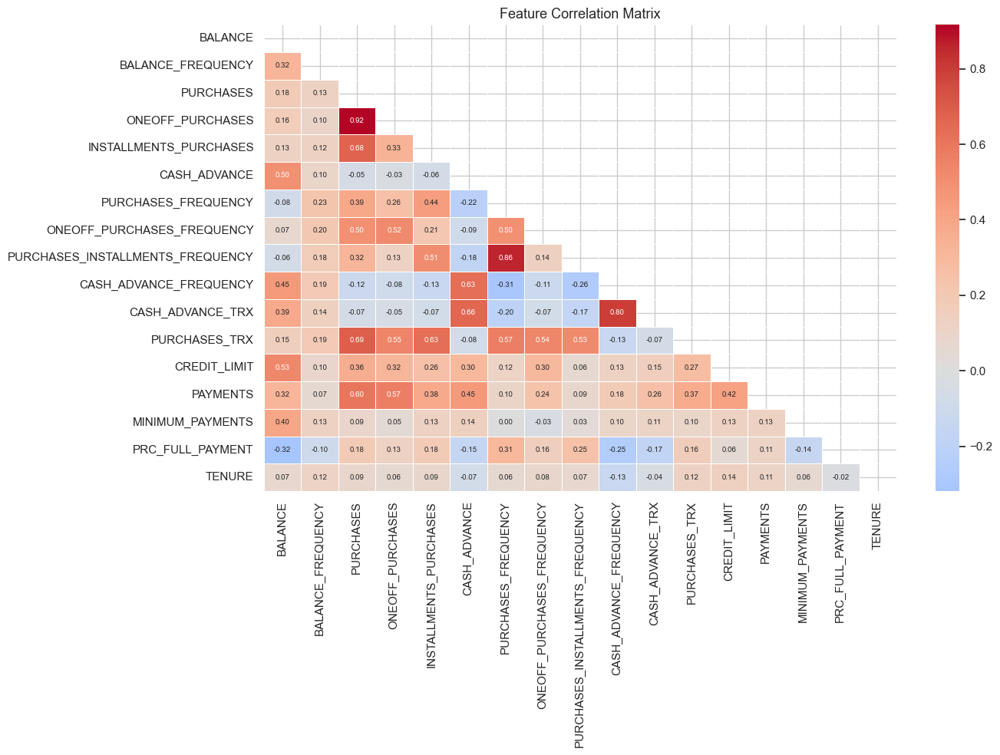
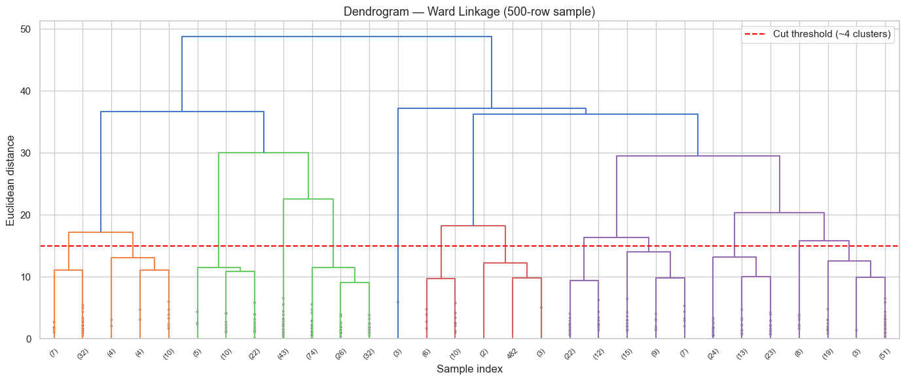
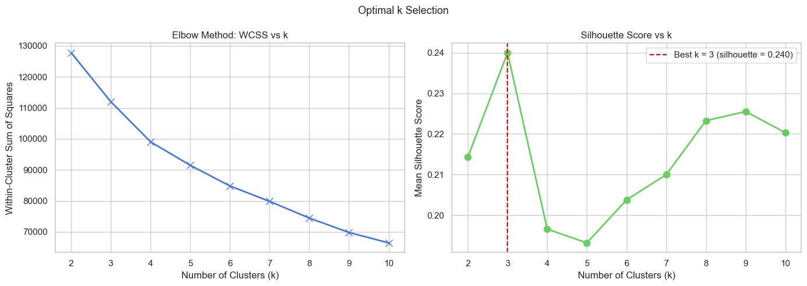
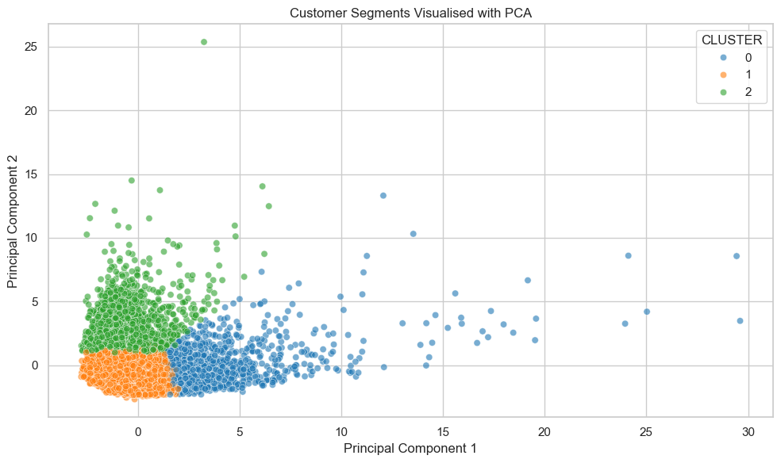
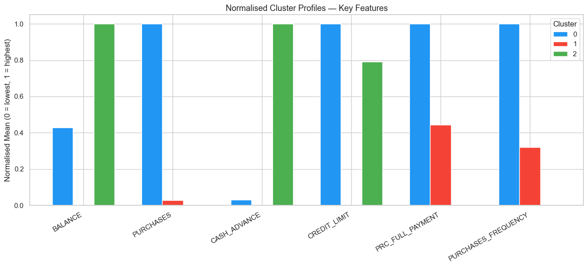

# Credit Card Customer Segmentation using Clustering

## Project Overview

This project applies unsupervised machine learning techniques to segment credit card customers based on their financial behaviour.

The project was originally completed as part of my **GoMyCode Data Science Programme checkpoint**, where the objective was to practise clustering techniques using a real-world credit card dataset. I later refined the project structure, preprocessing workflow, visualisations, clustering evaluation, and business interpretation to make it suitable for a professional data science portfolio.

The main goal of this project is to identify different customer groups based on usage patterns such as purchases, balances, cash advances, payments, credit limits, and repayment behaviour.

---

## Table of Contents

- [Project Overview](#project-overview)
- [Dataset Description](#dataset-description)
- [Project Objective](#project-objective)
- [Project Workflow](#project-workflow)
- [Data Preprocessing](#data-preprocessing)
- [Clustering Techniques Used](#clustering-techniques-used)
- [Final Customer Segments](#final-customer-segments)
- [Key Insights](#key-insights)
- [Business Recommendations](#business-recommendations)
- [Visualisations](#visualisations)
- [Technologies Used](#technologies-used)
- [Repository Structure](#repository-structure)
- [How to Run the Project](#how-to-run-the-project)
- [Requirements](#requirements)
- [Future Improvements](#future-improvements)
- [Conclusion](#conclusion)
- [Author](#author)

---

## Dataset Description

The dataset contains information about credit card customers over a six-month period.

It includes customer behaviour features such as:

- Balance
- Purchases
- One-off purchases
- Instalment purchases
- Cash advances
- Credit limit
- Payments
- Minimum payments
- Purchase frequency
- Cash advance frequency
- Tenure

Dataset summary:

| Item | Description |
|------|-------------|
| Dataset | Credit Card Dataset for Clustering |
| Rows | 8,950 customers |
| Columns | 18 columns |
| Clustering Features | 17 features after removing `CUST_ID` |
| Time Period | 6 months |

The `CUST_ID` column was removed because it is only a customer identifier and does not provide useful behavioural information for clustering.

---

## Project Objective

The objective of this project is to group credit card customers into meaningful segments using clustering techniques.

The specific objectives are to:

- Explore the credit card customer dataset
- Check for missing values and duplicates
- Clean and prepare the data for clustering
- Select relevant features for unsupervised learning
- Scale numerical features
- Apply hierarchical clustering
- Apply K-Means clustering
- Use evaluation methods to select a suitable number of clusters
- Visualise the final customer segments
- Interpret the clusters from a business perspective

---

## Project Workflow

The project follows this workflow:

1. Import necessary libraries
2. Load the dataset
3. Explore the dataset structure
4. Check missing values and duplicates
5. Handle missing values using median imputation
6. Remove the customer ID column
7. Scale the data using `StandardScaler`
8. Apply hierarchical clustering
9. Use the elbow method to test different cluster numbers
10. Evaluate clustering performance using silhouette score and Davies-Bouldin score
11. Build the final K-Means clustering model
12. Visualise customer segments using PCA
13. Profile and interpret the customer clusters
14. Provide business recommendations

---

## Data Preprocessing

### Missing Values

The dataset contained missing values in:

- `CREDIT_LIMIT`
- `MINIMUM_PAYMENTS`

These missing values were handled using median imputation because the financial columns are skewed and may contain extreme values.

### Feature Selection

The `CUST_ID` column was removed because it is a unique customer identifier and does not contribute to customer behaviour analysis.

### Feature Scaling

Feature scaling was applied using `StandardScaler`.

This step is important because clustering algorithms such as K-Means are distance-based. Without scaling, features with larger numerical ranges, such as `CREDIT_LIMIT`, `BALANCE`, and `PAYMENTS`, may dominate the clustering process.

---

## Clustering Techniques Used

### Hierarchical Clustering

Hierarchical clustering was used to explore possible natural groupings in the dataset. A dendrogram was created to help understand how customers may be grouped based on similarity.

### K-Means Clustering

K-Means clustering was used as the final clustering algorithm. Different values of `k` were tested to identify a suitable number of customer segments.

### Cluster Evaluation

The following methods were used to evaluate the clustering results:

- Elbow method
- Silhouette score
- Davies-Bouldin score

Although the Davies-Bouldin score improved at higher values of `k`, a higher number of clusters would make the customer segments harder to interpret for business use. Therefore, `k = 3` was selected because it gave the best silhouette score while keeping the segmentation simple and actionable.

The final silhouette score showed moderate separation between clusters, so the result should be treated as an exploratory customer segmentation rather than a perfect separation of customer types.

---

## Final Customer Segments

The final K-Means model grouped the customers into three main segments:

| Cluster | Segment Name | Description |
|---------|--------------|-------------|
| 0 | High-Value Active Purchasers | Customers with high purchases, higher credit limits, frequent purchasing behaviour, and strong payment activity. |
| 1 | Low-to-Moderate Activity Users | Customers with lower balances, lower purchases, lower payments, and moderate credit card activity. |
| 2 | Cash-Advance Users | Customers with high cash advance usage, higher balances, low purchase activity, and weaker full-payment behaviour. |

---

## Key Insights

The clustering analysis showed that credit card customers can be grouped into different behavioural segments.

The results suggest that:

- Some customers are highly active purchasers and may be valuable for loyalty rewards, premium offers, or cashback campaigns.
- The largest group consists of low-to-moderate activity users who may need targeted engagement campaigns.
- Cash-advance-heavy users may require closer credit risk monitoring and responsible borrowing support.

---

## Business Recommendations

### High-Value Active Purchasers

These customers can be targeted with:

- Loyalty rewards
- Cashback offers
- Premium card upgrades
- Personalised spending offers

### Low-to-Moderate Activity Users

These customers can be targeted with:

- Engagement campaigns
- Spending incentives
- Product education
- Usage-based promotions

### Cash-Advance Users

These customers may require:

- Credit risk monitoring
- Repayment support
- Responsible borrowing communication
- Credit exposure review

---

## Visualisations

The project includes several visualisations to support the analysis, clustering process, and interpretation of customer segments.

---

### Feature Distributions

This visualisation shows the distribution of the numerical features in the dataset. It helps identify skewed variables, extreme values, and differences in feature ranges before clustering.



---

### Correlation Heatmap

The correlation heatmap shows the relationships between numerical features in the dataset. This helps identify features that move together and provides a better understanding of customer financial behaviour.



---

### Hierarchical Clustering Dendrogram

The dendrogram was used to explore possible natural groupings in the dataset before applying K-Means clustering. A sample of the scaled dataset was used to keep the dendrogram readable.



---

### Elbow Method and Silhouette Score

This visualisation combines the elbow method and silhouette score comparison. It was used to compare different values of `k` and support the final choice of three clusters.



---

### PCA Cluster Visualisation

PCA was used to reduce the scaled dataset into two principal components so that the final customer segments could be visualised in two dimensions.



---

### Cluster Profile Comparison

This chart compares the normalised average values of key features across the final customer segments. It supports the interpretation of the three customer groups.



---

## Technologies Used

The project was built using:

- Python
- Pandas
- NumPy
- Matplotlib
- Seaborn
- Scikit-learn
- SciPy
- Jupyter Notebook

---

## Repository Structure

```text
credit-card-customer-segmentation
│
├── data
│   └── README.md
│
├── notebooks
│   └── credit_card_customer_segmentation.ipynb
│
├── images
│   ├── correlation_heatmap.png
│   ├── dendrogram.png
│   ├── elbow_silhouette_comparison.png
│   ├── pca_cluster_visualisation.png
│   └── cluster_profile_comparison.png
│
├── README.md
├── requirements.txt
└── .gitignore
```

---

## How to Run the Project

### 1. Clone the repository

```bash
git clone https://github.com/victoruzoe/credit-card-customer-segmentation.git
```

### 2. Navigate into the project folder

```bash
cd credit-card-customer-segmentation
```

### 3. Install the required libraries

```bash
pip install -r requirements.txt
```

### 4. Open Jupyter Notebook

```bash
jupyter notebook
```

### 5. Open the notebook file

```text
notebooks/credit_card_customer_segmentation.ipynb
```

---

## Requirements

The project uses the following Python libraries:

```text
pandas
numpy
matplotlib
seaborn
scikit-learn
scipy
jupyter
```

---

## Future Improvements

Future improvements for this project include:

- Applying log transformation to reduce the effect of highly skewed financial values
- Comparing K-Means with DBSCAN and Gaussian Mixture Models
- Testing different feature selection strategies
- Creating a Streamlit dashboard for interactive customer segmentation
- Adding deeper business profiling for each customer group
- Testing whether alternative preprocessing methods improve cluster separation

---

## Conclusion

This project demonstrates how unsupervised learning can be used to segment credit card customers based on behavioural and financial features.

Using K-Means clustering, the customers were grouped into three main segments:

- High-Value Active Purchasers
- Low-to-Moderate Activity Users
- Cash-Advance Users

The project shows practical skills in data cleaning, exploratory data analysis, feature scaling, clustering, model evaluation, visualisation, and business interpretation.

The final segmentation should be treated as exploratory because the silhouette score indicates moderate separation between groups. However, the results still provide useful insight into different customer behaviour patterns and how they can support marketing, engagement, and credit risk strategies.

---

## Author

**Victor Uzoewulu**

MSc Data Science Student  
University of the West of England, Bristol  

This project was originally completed as part of my **GoMyCode Data Science Programme checkpoint** and later refined as part of my data science portfolio.